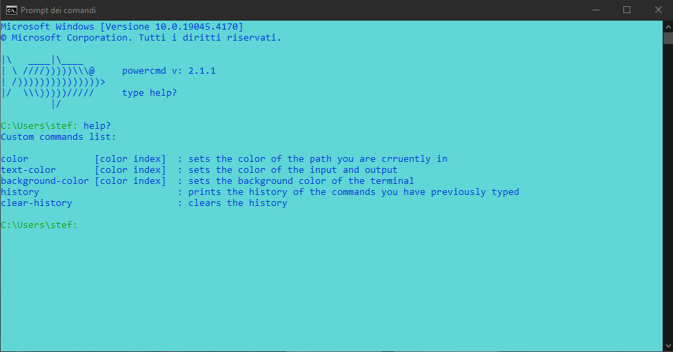

# PowerCmd

PowerCmd is a "wrapper" for cmd that adds these features:

- A persistent history of commands (through which navigate with arrow keys).
- A persistent session that saves the colors and the last directory you were in.
- Auto-completion of commands, programs in global environment variables.

## Requirements

To install it you need either to have gcc installed and with his path in global environment variables, or you will need to edit **install.ps1**.

## Installation

To install it, you just need to run **install.ps1** as **ADMINISTRATOR**.

If you want to uninstall it, just run **uninstall.ps1** as **ADMINISTRATOR**.

## Usage

You can use it by running cmd from applications (the installation process create a shortcut to the app that will be located in **%appdata%\PowerCmd\\** and will substitute it to the actual cmd shortcut located in **%appdata%\Microsoft\Windows\Start Menu\Programs\System Tools\\**).

## License

[MIT](https://choosealicense.com/licenses/mit/)
